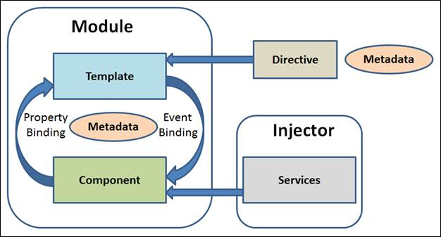
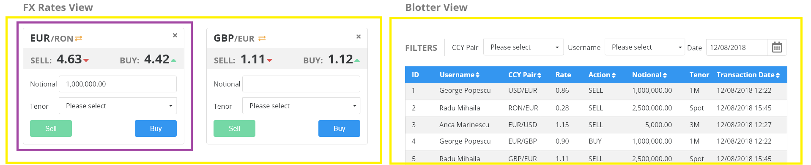

# Day 1 - Theory

## Table of contents

- [Introduction and Architecture](#introduction-and-architecture)
- [Why and how to split UI into components](#why-and-how-to-split-UI-into-components)
- [Components and Templates](#components-and-templates)
  - [Component Lifecycle](#component-lifecycle)
  - [Interpolation](#interpolation)
  - [Constructor or Variable Assignment](#constructor-or-variable-assignment)
  - [Create a class for the data](#create-a-class-for-the-data)
  - [Template Syntax](#template-syntax)
- [Binding](#binding)
- [Routes and Navigation](#routes-and-navigation)

## Introduction and Architecture

- [Angular](https://angular.io/) is a platform and framework for building client applications in HTML and TypeScript
- Angular implements functionalities as a set of TypeScript libraries that we import in our applications
- [TypeScript](https://www.typescriptlang.org/) is a statically compiled language to write clear and simple JavaScript code
- TypeScript is converted into plain JavaScript code
- [Angular CLI](https://angular.io/cli) is a command-line interface tool that we can use to initialize, develop and maintain Angular applications
- for example, if we want to create, build and serve a new Angular project on a development service, we can use:

    ```sh
    ng new my-project
    cd my-project
    ng serve
    ```

- basic building blocks are *NgModules* which collect related code
- modules are compilation context for *components*
- components define *views*, which are screen elements
- components use *services*, which provide some functionalities not directly related to views and can be injected to be used in many components
- both components and services are just classes with some *decorators* which mark their type and tell Angular how to use them
- the components are arranged hierarchically
- *Router* service provided by Angular helps us define the link between URL and views



## Why and how to split UI into components

- there is no rule saying that it is forbidden to have only one component in our application, but:
  - performance will be affected because every state change will re-render the entire application
  - code reusability will not be easy
  - state will be a huge object and it will be a real challenge to follow the impact of event handlers
  - working in a team will be terrible because of the code-conflicts
- to avoid these and many other problems, we should split our UI into many components
- we will know when to start splitting because we will experience at least one of the enumerated issues above
- we should be also careful because every split (and abstraction) of our code comes with a cost: it can not be easy to merge them into one functional piece
- basically, we should break up our components into smaller ones, but not until facing some real problems with our growing component
- here we have an example about how we splitted our FX-Trading dashboard into components:



## Components and Templates

- every Angular application has at least one component: *root*
- *root* connects components hierarchy with the DOM
- a component is a class that contains application data and logic and it is linked to a HTML template
- plays the part of controller/viewmodel from MVC architecture
- *@Component()* decorator identifies the class as a component
- we can generate a new component also using Angular CLI:

    ```sh
    ng generate component book
    ```

### Component Lifecycle

- every component has a lifecycle managed by Angular
- Angular creates it, renders it, creates and renders its children, checks it when its data-bound properties change and destroys it before removing it from the DOM
- we have **lifecycle hooks** that provide visibility into these key-life moments and the ability to act when they occur
- *e.g.*: ngOnInit

### Interpolation

- **interpolation** allows us to incorporate calculated strings into the text between HTML element tags
- *e.g.*:

```javascript
import { Component } from '@angular/core';

@Component({
    selector: 'root',
    template: '
        <p>We are learning {{myFavouriteLanguage}}</p>
    '
})
export class AppComponent {
    myFavouriteLanguage = 'Angular';
}
```

- to use this component, we just need to include the selector in HTML of the parent-component:

```HTML
<body>
    <root></root>
</body>
```

> **Note**
>
> We can have an inline template or a separate HTML, the choice depends on taste and circumstances.

### Constructor or Variable Assignment

- we can use a constructor or variable assignment to initialize the components
- variable assignment is exemplified above
- *e.g. for constructor*:

```javascript
export class AppComponent {
    title: myFavouriteLanguage;

    constructor() {
        this.title = 'Angular';
    }
}
```

> **Note**
>
> The choice between constructor or variable assignment is a personal style preference.

### Create a class for the data

- a good practice is to try to isolate the data structures from the component code
- this class will be called *Domain Model* and it is just a class used to store data and functions
- *e.g.*:

```javascript
class Joke {
    content: string;
    hide: boolean;

    constructor(content: string) {
        this.content = content;
        this.hide = true;
    }

    toggle() {
        this.hide = !this.hide;
    }
}
```

### Template Syntax

- the template represents the view in MVC architecture
- HTML is the language of Angular template
- we can use **interpolation** into template to bind a variable's value into the view
- a **template expression** produces a value: {{1 + 1}}
- many template expressions are similar to JavaScript, with a few exceptions that can have side-effects: assignments (=, +=, -=, ...), increment and decrement operators (++ and --) etc.
- a **template statement** responds to an *event*
- *e.g.*:

```HTML
<button (click)="toggle()">Show Joke!</button>
```

- **pipes** are used when we need some transformation for the bound values
- *e.g.:*

```HTML
<p>We want to display a book title in uppercase: {{bookTitle | uppercase}}
```

## Binding

- data binding is a mechanism for coordinating what users see with application data values
- we simply declare bindings between binding sources and target HTML elements
- Angular provides many kinds of data-binding:
    - from the source to view
        - *e.g.*:

        ```HTML
        {{expression}}
        [target]="expression"
        bind-target="expression"
        ```

    - from the view to source
         - *e.g.*:

        ```HTML
        (target)="expression"
        on-target="expression"
        ```

    - two-way binding: from both the source to view and from the view to source
        - *e.g.*:

        ```HTML
        [(target)]="expression"
        bindon-target="expression"
        ```
- we can observe that binding-types other than interpolation have a *target name* to the left of the equal sign, either surrounded by punctuation: [] or (), or preceded by a prefix: bind-, on- or bindon-.
- the **target of a data-binding** can be:
    - a property
        - *e.g.*:

        ```HTML
        <div [ngClass]="{'red': red}"></div>
        ```

    - an event
        - *e.g.*:

        ```HTML
        <button (click)="onUpdate()"></button>
        ```

    - an attribute name
        - *e.g.*:

        ```HTML
        <button [attr.aria-label]="help"></button>
        ```

> Note
>
> We have a choice between interpolation and property binding. When **rendering data values as strings**, there is **no technical reason to prefer one form to the other**. However, when **setting an element property to a non-string data value**, we must **use property binding**.

## Routes and Navigation

- Angular *Router* enables navigation from one view to the next
- it interprets a browser URL as an instruction to navigate to a client-generated view
- also can pass optional parameters that helps it decide what specific content to present
- we can navigate when the user clicks a button, selects from a drop box or as some response to another action
- in order to use it, we need to associate the path with the component we want to access when navigating to that route:

```javascript
const routes: Routes = [
    { path: 'books, component: BookListComponent }
]
```

- we will access that URL by clicking on a link, for example:

```HTML
<nav>
    <a routerLink="/books" routerLinkActive="active">Books</a>
</nav>
```
