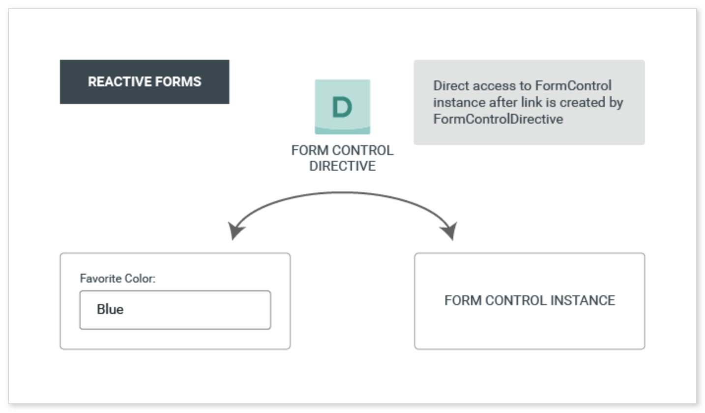
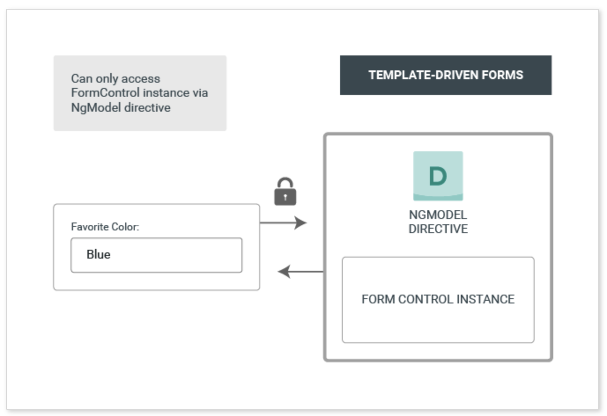

# Day 3 - Theory

## Table of contents

- [Directives](#directives)
  - [Structural Directives](#structural-directives)
  - [Attribute Directives](#attribute-directives)
  - [Creating our own directive](#creating-our-own-directive)
- [Pipes](#pipes)
- [Forms and Validations](#forms-and-validations)
  - [Reactive forms](#reactive-forms)
  - [Template-driven forms](#template-driven-forms)
  - [Key differences between Reactive and Template-driven forms](#key-differences-between-reactive-and-template-driven-forms)

## Directives

- at the core, directives are functions that execute whenever the Angular compiler find them in the DOM
- they are JavaScript classes declared as **@Directive**
- directives have **inputs** (set of necessary data-bound input properties) and **outputs** (set of event-bound output properties)
- there are 3 kinds of directives in Angular:
    - **Components**: directives with a template
    - **Structural directives**: change the DOM layout by adding and removing DOM elements
    - **Attribute directives**: change the appearance or behavior of an element, component or another directive

### Structural Directives

- are responsible for HTML layout
- they shape or reshape the DOM structure by adding, removing and manipulating the host elements
- they are easy to be recognised - an asterisk (*) precedes the directive attribute name
- *e.g.*:

    ```HTML
    <div *ngIf="isVisible">{{book.name}}</div>
    ```

- the most common built-in structural directives are:
    - **NgIf** - conditionally creates or destroys subviews from the template
    - **NgFor** - repeat a node for each item in a list
    - **NgSwitch** - a set of directives that switch among alternative views

### Attribute Directives

- listen to and modify the behavior of HTML elements, attributes, properties and components
- usually apply them to elements as if they were HTML attributes
- the most common built-in attribute directives are:
    - **NgClass** - adds and removes a set of CSS classes
    - **NgStyle** - adds and removes a set of HTML styles
    - **NgModel** - adds two-way data binding to an HTML form element

### Creating our own directive

- creating a directive is similar to creating a component:
    - import the **Directive** decorator (instead of the *Component* decorator)
    - import all we need for creating the directive
    - apply the decorator to the directive class
    - set the **attribute selector** that identifies the directive when applied to an element in a template
- *e.g.*:

    ```javascript
    import { Directive } from '@angular/core';

    @Directive({ selector: '[myDirective]'})
    export class MyDirective {
    }
    ```

## Pipes

- pipes are classes decorated with *@Pipe*
- when data arrives, the next goal is to display the information in a 'readable' way for the user
- for example, users prefer to see a date in a simple format like *May 15* intead of *Fri May 15 1959 00:00:00 GMT -0700 (Pacific Daylight Time)*
- same transformations can be needed repeatedly and this is the reason we need pipes
- pipes can be defined as **a way to write display-value transformation that we use in HTML**
- a pipe **takes in data as input and transforms it to a desired ourput**
- *e.g.*:

    ```HTML
    <p>Current date is: {{ new Date() | date }}</p>
    ```

- as we already observed in the last example, Angular comes with some built-in pipes like: *DatePipe*, *UpperCasePipe*, *LowerCasePipe*, *CurrencyPipe* and *PercentPipe*
- the pipes can accept any number of parameters:
- *e.g.*:

    ```HTML
    <p>Current date is: {{ new Date() | date: "MM/dd/yy" }}</p>
    ```

- multiple pipes may chained together on the same element
- *e.g.*:

    ```HTML
    <p>Current date is: {{ new Date() | date: "MM/dd/yy" | uppercase }}</p>
    ```
- we can also write our own custom pipes:

    ```javascript
    import { Pipe, PipeTransform } from '@angular/core';

    @Pipe({name: 'exponential'})
    export class ExponentialPipe implements PipeTransform {
        transform(value: number, exponent?: number): number {
            return Math.pow(value, isNaN(exponent) ? 1 : exponent);
        }
    }
    ```

## Forms and Validations

- applications use forms to enable users to log in, to update a profile or to perform many other data-entry tasks
- Angular provides two approaches to handling user input through forms: **reactive** and **template-driven**
- both capture user input events from the view, validate the user input, create a form model and data model to update and provide a way to track changes

### Reactive forms

- are more robust, scalable, reusable and testable
- best practice is to be used when forms are a key part of the application
- the form model provides the value and status of the form element at a given point of time: **model-driven approach**
- each form element in the view is directly linked to a form model (*FormControl* instance)
- updates from the view to the model and from the model to the view are synchronous and aren't dependent on the UI rendered



- validators are not added through attributes in the template
- validator functions are added directly to the form control model in the component class
- *e.g.*:

    ```javascript
    ngOnInit(): void {
        this.bookForm = new FormGroup({
            name: new FormControl(this.book.name, [
                Validators.required,
                Validators.minLength(4)
            ])
        })
    }
    ```

> Note
>
> We can also create our own Custom Validators.

### Template-driven forms

- easy to be added in an app
- don't scale as well as reactive forms
- best practice is to be used if form requirements are basic and logic can be managed only in the template
- the template provides the value and status of the form element at a given point of time:**template-driven approach**
- each element is linked to a directive that manages the form model internally



- to add validation, we need to add the same validation attributes and for native HTML form validation
- every time the value of a form control changes, Angular runs validation and generates a list of validation errors, which results in an *INVALID* status, or null, which results in a *VALID* status
- *e.g.*:

    ```HTML
    <input id="name" name="name" class="form-control" required minlength="4" [(ngModel="book.name")]>
    <div *ngIf="name.invalid && (name.dirty || name.touched)" class="alert alert-danger">
        <div *ngIf="name.errors.required">Name is required.</div>
        <div *ngIf="name.errors.minlength">Name must be at least 4 characters long.</div>
    </div>
    ```

> Note
>
> We can also create our own Custom Validators.

### Key differences between Reactive and Template-driven forms

| Key | Reactive | Template-driven |
| ------------- | ------------- | ------------- |
| Setup (form model) | More explicit, created in component class  | Less explicit, created by directives  |
| Data model | Structured | Unstructured |
| Predictability | Synchronous | Asynchronous |
| Form validation | Functions | Directives |
| Mutability | Immutable | Mutable |
| Scalability | Low-level API access | Abstraction on top of APIs |

