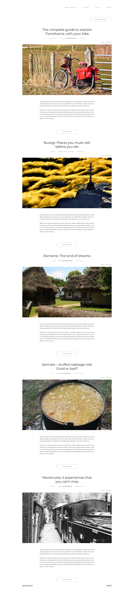
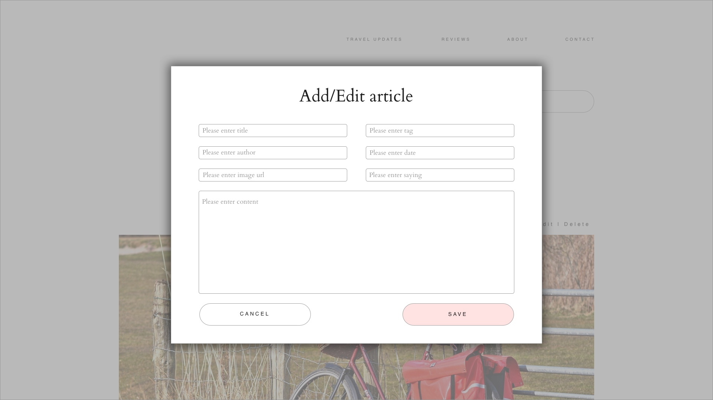
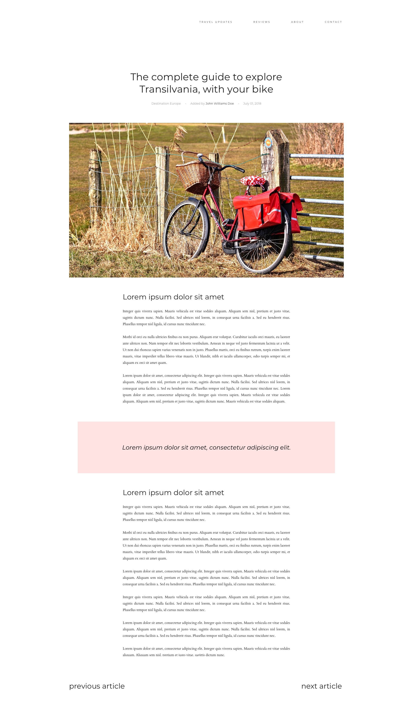
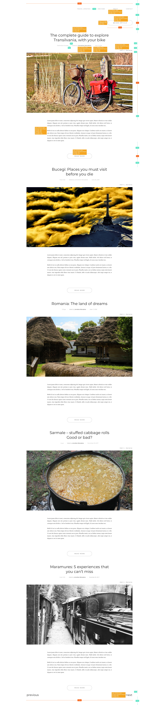
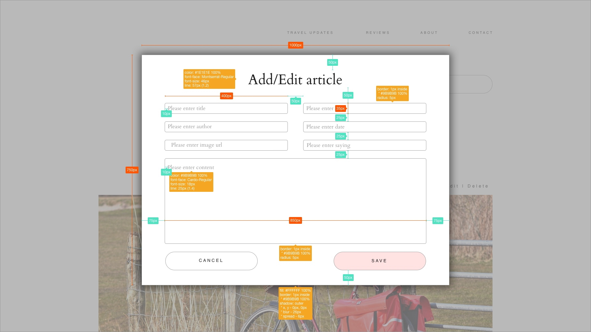
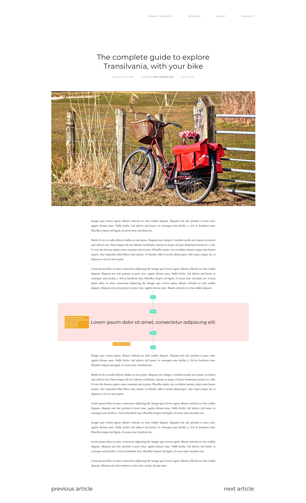

# Design Personal Blog

## Table of contents

- [Requirements](#requirements)
  - [Home page](#home-page)
  - [Details page](#details-page)
- [Design](#design)
- [Specs](#specs)

## Requirements

### Home page

- a page that displays all the blog articles and allows the user to execute CRUD operations on them
- the page contains:
  - *Add article* button that opens a [modal](#add-or-edit-article-modal) for adding a new article to the list
  - the list of articles, paginated into 3 articles per page. Each article contains the following info:
    - the title
    - the tag, the author and the date
    - the image
    - the preview of its content (first 1000 characters)
    - *Edit* button that opens a [modal](#add-or-edit-article-modal) for editing the article
    - *Delete* button that removes that article from the list
    - *Read More* button that redirect the user to the [article details page](#details-page)
  - *previous* and *next* buttons that allow the user to navigate through the articles list

#### Add or Edit article modal

- a modal that allows the user to Add or Edit an article
- the page contains:
  - *Add/Edit article* title
  - *Title* field
  - *Tag* field
  - *Author* field
  - *Date* field
  - *Image URL* field
  - *Quote* field
  - *Content* field
  - *Cancel* button that closes te modal with no action
  - *Save* button that submits the form (add a new article or edit a specific article)

### Details page

- a page that presents all the details about a specific article
- the page contains the following info:
  - the title
  - the tag, the author and the date
  - the image
  - the content
  - a quote that will split the content in 2 parts
  - *previous article* and *next article* buttons that allow the user to navigate through the articles in the list

## Design

## Specs

